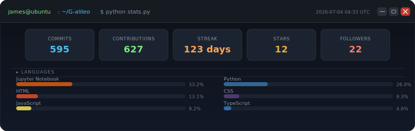

<div align="center">

<a href="https://github.com/G-alileo">
  <picture>
    <source media="(prefers-color-scheme: dark)" srcset="https://readme-typing-svg.demolab.com?font=JetBrains+Mono&weight=700&size=26&duration=2800&pause=1200&color=4FC3F7&center=true&vCenter=true&width=700&lines=James+Peter+Murithi;Full-Stack+%26+AI%2FML+Engineer;Backend+%C2%B7+Agentic+AI+%C2%B7+Fintech;Building+from+Nairobi+%F0%9F%87%B0%F0%9F%87%AA" />
    
  </picture>
</a>

<br/>

[](https://linkedin.com/in/jamespetermurithi)
[](mailto:jamespmurithi@gmail.com)
[](https://github.com/G-alileo)

</div>

<br>

```python
class JamesMurithi:
    role       = "Full-Stack & AI/ML Engineer"
    location   = "Nairobi, Kenya 🇰🇪"
    now        = "Agentic AI workflows · Fintech APIs · RAG pipelines"
    stack      = ["Python", "Django", "React", "PostgreSQL", "Redis", "Docker"]
    ai_stack   = ["Google ADK", "AWS Strands", "ChromaDB", "Milvus", "NLTK"]
    ml_models  = ["Logistic Regression", "KNN", "Decision Trees", "NLP pipelines"]
    also       = ["MERN Stack", "Java", "C++", "GraphQL", "Kubernetes"]
    available  = "OSS collab · AI/backend architecture · Interesting problems"
    fact       = "Galileo questioned everything. So do I — starting with bad API design."
```

<br>

### What I Ship

| Domain | Tools & Tech |
|:---|:---|
| **Agentic AI** | Google ADK · AWS Strands · Agentic Workflows · LLM Orchestration |
| **ML & NLP** | scikit-learn · NLTK · Logistic Regression · KNN · Pandas · NumPy |
| **Vector & RAG** | ChromaDB · Milvus · RAG Pipelines · Embeddings |
| **APIs & Backend** | Django REST · FastAPI · Flask · JWT · OAuth · GraphQL |
| **Full Stack** | React · TailwindCSS · Node.js · Express · MERN |
| **Databases** | PostgreSQL · MongoDB · Redis · MySQL · SQLite |
| **API Security & Testing** | JWT · OAuth2 · Rate Limiting · Postman · Pytest |
| **Infrastructure** | Docker · AWS · Nginx · GitHub Actions · Kubernetes |
| **Languages** | Python · JavaScript · Java · C++ · SQL |

<br>

### By the Numbers

<div align="center">



</div>

<br>

### Contribution Activity

<div align="center">

<picture>
  <source media="(prefers-color-scheme: dark)" srcset="https://raw.githubusercontent.com/G-alileo/G-alileo/output/github-snake-dark.svg" />
  <source media="(prefers-color-scheme: light)" srcset="https://raw.githubusercontent.com/G-alileo/G-alileo/output/github-snake.svg" />
  
</picture>

</div>

<br>

<div align="center">

*Open to collabs. If you're building something real — let's talk.*

**[jamespmurithi@gmail.com](mailto:jamespmurithi@gmail.com)**

</div>